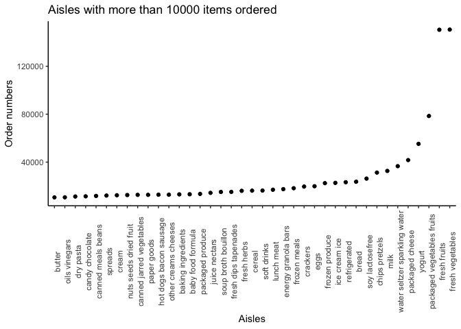
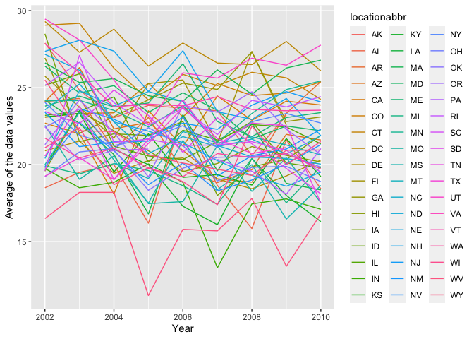

p8105\_hw3\_sz3030
================
Shaocong Zhang
10/18/2021

# Problem 1

## Load the dataset

``` r
library(tidyverse)
```

    ## ── Attaching packages ─────────────────────────────────────── tidyverse 1.3.1 ──

    ## ✓ ggplot2 3.3.5     ✓ purrr   0.3.4
    ## ✓ tibble  3.1.4     ✓ dplyr   1.0.7
    ## ✓ tidyr   1.1.3     ✓ stringr 1.4.0
    ## ✓ readr   2.0.1     ✓ forcats 0.5.1

    ## ── Conflicts ────────────────────────────────────────── tidyverse_conflicts() ──
    ## x dplyr::filter() masks stats::filter()
    ## x dplyr::lag()    masks stats::lag()

``` r
library(ggridges)
library(p8105.datasets)
data("instacart")
```

The dataset has 1384617 rows and 15 columns. The 15 variables include
different kinds of order, product and user id information, aisles’ id
and their information and product names extra.

``` r
instacart %>%
  group_by(aisle) %>%
  count() %>%
  arrange(n)
```

    ## # A tibble: 134 × 2
    ## # Groups:   aisle [134]
    ##    aisle                          n
    ##    <chr>                      <int>
    ##  1 beauty                       287
    ##  2 frozen juice                 294
    ##  3 baby accessories             306
    ##  4 baby bath body care          328
    ##  5 kitchen supplies             448
    ##  6 specialty wines champagnes   461
    ##  7 ice cream toppings           504
    ##  8 shave needs                  532
    ##  9 skin care                    534
    ## 10 first aid                    539
    ## # … with 124 more rows

As this is a 134 x 2 tibble, then there are 134 aisles here and “fresh
vegetables” and “fresh fruits” aisles are the most items ordered from.

## Make a plot that shows the number of items ordered in each aisle, limiting this to aisles with more than 10000 items ordered. Arrange aisles sensibly, and organize your plot so others can read it.

``` r
instacart %>%
  count(aisle) %>%
  filter(n > 10000) %>%
  mutate(aisle = fct_reorder(aisle, n)) %>% 
  ggplot(aes(x = aisle, y = n)) + 
  geom_point() +
  theme_classic() +
  theme(axis.text.x = element_text(angle = 90, hjust = 0.5)) +
  labs(
    title = "Aisles with more than 10000 items ordered" ,
    x = "Aisles" ,
    y = "Order numbers"
  )
```

<!-- -->

## Make a table showing the three most popular items in each of the aisles “baking ingredients”, “dog food care”, and “packaged vegetables fruits”. Include the number of times each item is ordered in your table.

``` r
instacart %>%
  filter(aisle %in% c("baking ingredients", "dog food care", "packaged vegetables fruits")) %>%
  group_by(aisle) %>%
  count(product_name) %>%
  mutate(pop_rank = min_rank(desc(n))) %>%
  filter(pop_rank < 4) %>%
  arrange(desc(n)) %>%
  knitr::kable()
```

| aisle                      | product\_name                                 |    n | pop\_rank |
|:---------------------------|:----------------------------------------------|-----:|----------:|
| packaged vegetables fruits | Organic Baby Spinach                          | 9784 |         1 |
| packaged vegetables fruits | Organic Raspberries                           | 5546 |         2 |
| packaged vegetables fruits | Organic Blueberries                           | 4966 |         3 |
| baking ingredients         | Light Brown Sugar                             |  499 |         1 |
| baking ingredients         | Pure Baking Soda                              |  387 |         2 |
| baking ingredients         | Cane Sugar                                    |  336 |         3 |
| dog food care              | Snack Sticks Chicken & Rice Recipe Dog Treats |   30 |         1 |
| dog food care              | Organix Chicken & Brown Rice Recipe           |   28 |         2 |
| dog food care              | Small Dog Biscuits                            |   26 |         3 |

## Make a table showing the mean hour of the day at which Pink Lady Apples and Coffee Ice Cream are ordered on each day of the week; format this table for human readers (i.e. produce a 2 x 7 table)

``` r
instacart %>%
  filter(product_name %in% c("Pink Lady Apples", "Coffee Ice Cream")) %>%
  group_by(product_name, order_dow) %>%
  summarize(
    mean_hour_of_day = mean(order_hour_of_day)
  ) %>%
  mutate(order_dow = recode_factor(order_dow, '0' = '7',
                                     '1' = '1', '2' = '2', '3' = '3', '4' = '4', '5' = '5', '6' = '6')) %>%
  pivot_wider(names_from = order_dow, values_from = mean_hour_of_day) %>%
  knitr::kable()
```

    ## `summarise()` has grouped output by 'product_name'. You can override using the `.groups` argument.

| product\_name    |        7 |        1 |        2 |        3 |        4 |        5 |        6 |
|:-----------------|---------:|---------:|---------:|---------:|---------:|---------:|---------:|
| Coffee Ice Cream | 13.77419 | 14.31579 | 15.38095 | 15.31818 | 15.21739 | 12.26316 | 13.83333 |
| Pink Lady Apples | 13.44118 | 11.36000 | 11.70213 | 14.25000 | 11.55172 | 12.78431 | 11.93750 |

# Problem 2

## Load the dataset

``` r
data("brfss_smart2010")
```

The dataset has 134203 rows and 23 columns. The 23 variables contain
information on lcoation, topic, question, response, and response number.

## First, do some data cleaning:

``` r
brfss_smart2010 = 
  brfss_smart2010 %>%
  janitor::clean_names() %>% 
  filter(topic == "Overall Health",
         response %in% c("Excellent", "Very good", "Good", "Fair", "Poor")) %>%
  mutate(response = factor(response, levels = c("Poor", "Fair", "Good", "Very good", "Excellent")))
```

## In 2002, which states were observed at 7 or more locations? What about in 2010?

``` r
# In 2002
brfss_2002 =
  brfss_smart2010 %>%
  filter(year == 2002) %>%
  group_by(locationabbr, locationdesc) %>%
  distinct(locationabbr) %>%
  group_by(locationabbr) %>%
  summarize(n_locations = n()) %>% 
  filter(n_locations >= 7) %>%
  arrange(n_locations)

brfss_2002
```

    ## # A tibble: 6 × 2
    ##   locationabbr n_locations
    ##   <chr>              <int>
    ## 1 CT                     7
    ## 2 FL                     7
    ## 3 NC                     7
    ## 4 MA                     8
    ## 5 NJ                     8
    ## 6 PA                    10

``` r
# In 2010
brfss_2010 =
  brfss_smart2010 %>%
  filter(year == 2010) %>%
  group_by(locationabbr, locationdesc) %>%
  distinct(locationabbr) %>%
  group_by(locationabbr) %>%
  summarize(n_locations = n()) %>% 
  filter(n_locations >= 7) %>%
  arrange(n_locations)

brfss_2010
```

    ## # A tibble: 14 × 2
    ##    locationabbr n_locations
    ##    <chr>              <int>
    ##  1 CO                     7
    ##  2 PA                     7
    ##  3 SC                     7
    ##  4 OH                     8
    ##  5 MA                     9
    ##  6 NY                     9
    ##  7 NE                    10
    ##  8 WA                    10
    ##  9 CA                    12
    ## 10 MD                    12
    ## 11 NC                    12
    ## 12 TX                    16
    ## 13 NJ                    19
    ## 14 FL                    41

## Construct a dataset that is limited to Excellent responses, and contains, year, state, and a variable that averages the data\_value across locations within a state. Make a “spaghetti” plot of this average value over time within a state (that is, make a plot showing a line for each state across years – the geom\_line geometry and group aesthetic will help).

``` r
brfss_smart2010 %>%
  filter(response == "Excellent") %>%
  select(year, locationabbr, data_value) %>%
  group_by(year, locationabbr) %>%
  summarise(avg_data_value = mean(data_value)) %>%
  ggplot(aes(x = year, y = avg_data_value, group = locationabbr, color = locationabbr)) +
  geom_line() +
  labs(
    x = "Year",
    y = "Average of the data values"
  )
```

    ## `summarise()` has grouped output by 'year'. You can override using the `.groups` argument.

    ## Warning: Removed 3 row(s) containing missing values (geom_path).

<!-- -->
